# Esquema Conceptual del Proyecto - Market Features Analysis

## Visión General

Este proyecto analiza características de mercado (market features) a partir de tres fuentes de datos principales: Candles (OHLCV), Order Book snapshots y Trades. El sistema calcula 39 indicadores diferentes agrupados en tres categorías y genera reportes en Excel y PDF.

---

## Diagrama de Flujo

```mermaid
%%{init: {'theme':'base', 'themeVariables': { 'fontSize':'16px', 'primaryTextColor':'#000000', 'secondaryTextColor':'#000000', 'tertiaryTextColor':'#000000'}}}%%
graph TB
    %% Fuentes de Datos
    subgraph "FUENTES DE DATOS"
        A1[📊 Candles<br/>timestamp, OHLCV<br/>volume, n_trades]
        A2[📖 Order Book<br/>timestamp, best_bid<br/>best_ask, sizes]
        A3[💱 Trades<br/>timestamp, price<br/>size, side]
    end

    %% Loader
    B[🔄 MarketLoader<br/>load_all&#40;&#41;]

    A1 --> B
    A2 --> B
    A3 --> B

    %% Processing
    subgraph "PROCESAMIENTO"
        C[⚙️ compute_all_features&#40;&#41;<br/>Resampling: 3h windows]

        subgraph "CÁLCULO DE FEATURES"
            D1[💰 PRICE FEATURES<br/>11 indicadores]
            D2[📚 ORDER BOOK FEATURES<br/>16 indicadores]
            D3[📈 TRADES FEATURES<br/>12 indicadores]
        end
    end

    B --> C
    C --> D1
    C --> D2
    C --> D3

    %% Price Features Detail
    subgraph "PRICE INDICATORS"
        P1["last_mid_price: close"]
        P2["price_avg: mean(close)"]
        P3["price_std: std(close)"]
        P4["price_diff_pct_t_1: pct_change"]
        P5["price_velocity: ΔP/ΔT"]
        P6["high, low: max/min"]
        P7["return_volatility: std(log returns)"]
        P8["microtrend_slope: linregress"]
        P9["velocity_ratio: short/long"]

        P1 --> P2 --> P3 --> P4 --> P5 --> P6 --> P7 --> P8 --> P9
    end

    D1 -.-> P1

    %% Order Book Features Detail
    subgraph "ORDER BOOK INDICATORS"
        O1["mid_price: mean(bid+ask)/2"]
        O2["spread_abs: mean(ask-bid)"]
        O3["spread_rel: spread/mid_price"]
        O4["depth_5/10/20: liquidity levels"]
        O5["liquidity_imbalance: (bid-ask)/total"]
        O6["market_pressure_index"]
        O7["queue_dynamics: change rate"]
        O8["slippage_cost: impact"]
        O9["order_book_entropy: Shannon"]

        O1 --> O2 --> O3 --> O4 --> O5 --> O6 --> O7 --> O8 --> O9
    end

    D2 -.-> O1

    %% Trades Features Detail
    subgraph "TRADES INDICATORS"
        T1["total_volume: sum(size)"]
        T2["buy/sell_volume: by side"]
        T3["taker_aggr_ratio: buy/sell"]
        T4["vwap: weighted avg price"]
        T5["volume_imbalance: (buy-sell)/total"]
        T6["vol_signature: P90/median"]
        T7["volume_burst_score: z-score"]
        T8["trade_flow_imbalance: rolling"]
        T9["inter_arrival_time: mean time"]

        T1 --> T2 --> T3 --> T4 --> T5 --> T6 --> T7 --> T8 --> T9
    end

    D3 -.-> T1

    %% Output
    subgraph "REPORTES"
        E1[📊 Excel<br/>5 sheets:<br/>Features, Impresión<br/>Estadísticas, Correlaciones<br/>Configuración]
        E2[📄 PDF<br/>Portada<br/>6 Gráficos principales<br/>Tablas estadísticas]
    end

    D1 --> E1 & E2
    D2 --> E1 & E2
    D3 --> E1 & E2

    %% Styling
    classDef dataSource fill:#e1f5ff,stroke:#0078d4,stroke-width:2px
    classDef processor fill:#fff4ce,stroke:#f9a825,stroke-width:2px
    classDef features fill:#e8f5e9,stroke:#4caf50,stroke-width:2px
    classDef indicators fill:#f3e5f5,stroke:#9c27b0,stroke-width:1px
    classDef output fill:#ffe0b2,stroke:#ff6f00,stroke-width:2px

    class A1,A2,A3 dataSource
    class B,C processor
    class D1,D2,D3 features
    class P1,P2,P3,P4,P5,P6,P7,P8,P9,O1,O2,O3,O4,O5,O6,O7,O8,O9,T1,T2,T3,T4,T5,T6,T7,T8,T9 indicators
    class E1,E2 output
```



---

## 1. Fuentes de Datos

### 📊 Candles (OHLCV)
**Archivo:** `binance_USDT-BRL_1m_candles.csv`

**Campos:**
- `timestamp` (epoch seconds) → convertido a datetime UTC
- `open`, `high`, `low`, `close` (precio)
- `volume` (volumen en base currency)
- `quote_asset_volume`
- `n_trades` (número de trades)
- `taker_buy_base_volume`, `taker_buy_quote_volume`

**Loader:** `MarketLoader.load_candles(path, interval="1m")`

---

### 📖 Order Book Snapshots
**Archivos:** `binance_USDT-BRL_order_book_snapshots_YYYY-MM-DD.txt`

**Formato JSON por línea:**
```json
{
  "ts": 1760106864.0,
  "bids": [[price, size], ...],
  "asks": [[price, size], ...]
}
```

**Campos extraídos:**
- `timestamp` (datetime UTC)
- `best_bid` (max price in bids)
- `best_bid_size`
- `best_ask` (min price in asks)
- `best_ask_size`

**Loader:** `MarketLoader.load_orderbooks(folder)`

---

### 💱 Trades
**Archivos:** `binance_USDT-BRL_trades_YYYY-MM-DD.txt`

**Formato JSON por línea:**
```json
{
  "ts": 1760106864.009,
  "price": 5.4485,
  "q_base": 10.5,
  "side": "buy"
}
```

**Campos extraídos:**
- `timestamp` (datetime UTC)
- `price` (float)
- `size` (base quantity, from q_base)
- `side` ('buy' or 'sell')

**Loader:** `MarketLoader.load_trades(folder)`

---

## 2. Procesamiento

### MarketLoader
**Ubicación:** `features/market_loader.py`

**Función principal:**
```python
candles, orderbook, trades = market_loader.load_all(
    candles_path,
    orderbooks_folder,
    trades_folder
)
```

**Características:**
- Carga las 3 fuentes de datos
- Filtra por `date_range` si se especifica
- Ordena por timestamp
- Normaliza formatos (epoch → datetime UTC)

---

### Cálculo de Features
**Ubicación:** `src/market_features.py`

**Función principal:**
```python
features_df = compute_all_features(
    candles,
    orderbook,
    trades,
    config,
    resample=True
)
```

**Parámetros de configuración** (`config/market_report.yml`):
```yaml
resampling:
  interval: "3h"        # Ventana temporal
  label: "end"          # Alineación de ventana
  include_partial: false

price:
  short_window: 15      # Ventana corta para velocidad
  long_window: 60       # Ventana larga para velocidad

order_book:
  standard_order_size: 1000.0  # Para slippage cost

trades:
  volume_window: 50     # Detección de burst
  flow_window: 20       # Trade flow imbalance
```

---

## 3. Features Calculadas (39 total)

### 💰 PRICE FEATURES (11 indicadores)

| Feature | Fórmula | Descripción |
|---------|---------|-------------|
| `last_mid_price` | `close[-1]` | Último precio de cierre |
| `price_avg` | `mean(close)` | Precio promedio en ventana |
| `price_std` | `std(close)` | Desviación estándar del precio |
| `price_diff_pct_t_1` | `((close[-1]/close[-2]) - 1) × 100` | Cambio % respecto a período anterior |
| `price_velocity` | `(close[-1] - close[-n_steps-1]) / n_steps` | Velocidad del precio (ΔP/ΔT) |
| `high` | `max(high)` | Precio máximo en ventana |
| `low` | `min(low)` | Precio mínimo en ventana |
| `delta_high_low` | `high - low` | Rango de precios |
| `return_volatility` | `std(log(close[1:]/close[:-1]))` | Volatilidad de log-returns |
| `microtrend_slope` | `linregress(x, y).slope` | Pendiente de tendencia reciente |
| `short_vs_long_velocity_ratio` | `short_vel / long_vel` | Ratio de velocidades corto/largo plazo |

**Código:** `src/market_features.py:204-284`

---

### 📚 ORDER BOOK FEATURES (16 indicadores)

| Feature | Fórmula | Descripción |
|---------|---------|-------------|
| `mid_price` | `mean((best_bid + best_ask) / 2)` | Precio medio promedio |
| `best_bid` | `best_bid[-1]` | Última mejor oferta de compra |
| `best_ask` | `best_ask[-1]` | Última mejor oferta de venta |
| `spread_abs` | `mean(best_ask - best_bid)` | Spread absoluto promedio |
| `spread_rel` | `spread_abs / mid_price` | Spread relativo (%) |
| `depth_5` | `(avg_bid_size + avg_ask_size) × 5` | Profundidad 5 niveles (proxy) |
| `depth_10` | `(avg_bid_size + avg_ask_size) × 10` | Profundidad 10 niveles (proxy) |
| `depth_20` | `(avg_bid_size + avg_ask_size) × 20` | Profundidad 20 niveles (proxy) |
| `total_bid_liquidity` | `sum(best_bid_size)` | Liquidez total lado compra |
| `total_ask_liquidity` | `sum(best_ask_size)` | Liquidez total lado venta |
| `liquidity_imbalance` | `(bid_liq - ask_liq) / (bid_liq + ask_liq)` | Desbalance de liquidez |
| `market_pressure_index` | `liquidity_imbalance / (1 + spread_rel)` | Índice de presión de mercado |
| `queue_dynamics` | `(bid_changes + ask_changes) / (2 × (n-1))` | Tasa de cambios en cola |
| `order_book_convexity` | `1 / (1 + std(bid_sizes) + std(ask_sizes))` | Concentración de liquidez |
| `slippage_cost` | `(order_size / avg_depth) × spread_rel × 100` | Costo estimado de slippage (%) |
| `order_book_entropy` | `-sum(p × log2(p))` | Entropía de Shannon de liquidez |

**Código:** `src/market_features.py:291-409`

---

### 📈 TRADES FEATURES (12 indicadores)

| Feature | Fórmula | Descripción |
|---------|---------|-------------|
| `total_volume` | `sum(size)` | Volumen total negociado |
| `buy_volume` | `sum(size[side=='buy'])` | Volumen de compras |
| `sell_volume` | `sum(size[side=='sell'])` | Volumen de ventas |
| `taker_aggressiveness_ratio` | `buy_volume / sell_volume` | Ratio de agresividad compradores |
| `vwap` | `sum(price × size) / sum(size)` | Precio promedio ponderado por volumen |
| `volume_imbalance` | `(buy_vol - sell_vol) / (buy_vol + sell_vol)` | Desbalance de volumen |
| `microstructural_volume_signature` | `percentile(size, 90) / median(size)` | Ratio P90/mediana de trades |
| `volume_burst_score` | `(current_vol - mean_vol) / std_vol` | Z-score de volumen (detección bursts) |
| `average_trade_size` | `mean(size)` | Tamaño promedio de trade |
| `volume_time_distribution` | `gini_coefficient(vol_by_bin)` | Concentración temporal (Gini) |
| `trade_flow_imbalance` | `rolling_imbalance[-1]` | Desbalance en ventana móvil |
| `inter_arrival_time` | `mean(timestamp.diff())` | Tiempo promedio entre trades (s) |

**Código:** `src/market_features.py:416-555`

---

## 4. Reportes Generados

### 📊 Excel Report
**Archivo:** `output/market_features_YYYYMMDD_HHMMSS.xlsx`

**5 hojas:**

1. **Features** - Datos técnicos (time × features)
2. **Reporte Impresión** - Formato pivotado (features × time) en español
3. **Estadísticas** - Estadísticas descriptivas en español
4. **Correlaciones** - Matriz de correlación entre features
5. **Configuración** - Parámetros utilizados en el cálculo

---

### 📄 PDF Report
**Archivo:** `output/market_features_report_YYYYMMDD_HHMMSS.pdf`

**3 páginas:**

1. **Portada** - Información del reporte (par, exchange, período, configuración)
2. **Visualizaciones** - 6 gráficos principales:
   - Evolución del Precio
   - Volatilidad de Retornos
   - Spread Relativo (bps)
   - Desbalance de Liquidez
   - Volumen de Trading
   - Desbalance de Volumen
3. **Estadísticas** - Tabla con estadísticas descriptivas de features principales

---

## 5. Estructura del Proyecto

```
research_notebooks/eda_strategies/rlmm/
├── config/
│   └── market_report.yml          # Configuración de features
├── data/
│   ├── candles/                   # Archivos CSV de candles
│   ├── order_book/                # Snapshots JSON de order book
│   └── trades/                    # Trades JSON
├── docs/
│   └── 00_Esquema_del_proyecto.md # Este documento
├── features/
│   └── market_loader.py           # Carga de datos
├── output/
│   ├── *.xlsx                     # Reportes Excel generados
│   └── *.pdf                      # Reportes PDF generados
├── src/
│   ├── __init__.py
│   ├── config_loader.py           # Carga de configuración
│   ├── market_features.py         # Cálculo de features
│   └── utils/
│       ├── __init__.py
│       └── validators.py          # Validaciones
└── quick_excel_report.ipynb       # Notebook principal
```

---

## 6. Uso Básico

```python
from features.market_loader import MarketLoader
from src.market_features import compute_all_features
import yaml

# 1. Configurar
exchange = "binance"
trading_pair = "USDT-BRL"
date_range = ("2025-10-11", "2025-10-12")

# 2. Cargar datos
market_loader = MarketLoader(
    exchange=exchange,
    trading_pair=trading_pair,
    date_range=date_range
)
candles, orderbook, trades = market_loader.load_all(
    candles_path,
    orderbook_path,
    trades_path
)

# 3. Cargar configuración
with open('config/market_report.yml', 'r') as f:
    config = yaml.safe_load(f)

# 4. Calcular features
features_df = compute_all_features(
    candles,
    orderbook,
    trades,
    config,
    resample=True
)

# 5. Exportar
features_df.to_excel('output/features.xlsx')
```

---

## 7. Referencias

- **MarketLoader:** `features/market_loader.py`
- **Feature Calculation:** `src/market_features.py`
- **Configuration:** `config/market_report.yml`
- **Main Notebook:** `quick_excel_report.ipynb`

---

## Notas Técnicas

- **Resampling:** Las features se calculan en ventanas de tiempo configurables (default: 3h)
- **Timezone:** Todos los timestamps se manejan en UTC
- **Validación:** Se requiere que las 3 fuentes de datos tengan overlap temporal
- **Proxies:** Algunas features usan aproximaciones cuando no hay datos completos (ej: depth_5/10/20)
- **Error Handling:** Ventanas sin datos se omiten del resultado final