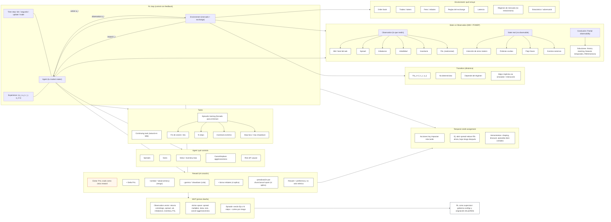

```mermaid
flowchart LR
  %% =========================
  %% RL para Market Making
  %% =========================

  subgraph LOOP["RL loop (control con feedback)"]
    A["Agent (tu market maker)"] -->|action a_t| E["Environment (mercado + exchange)"]
    E -->|observation o_t| A
    E -->|reward r_t| A
    T["Time step: tick / segundo / update / trade"] --- A
    X["Experience: (o_t, a_t, r_t, o_t+1)"] --- A
  end

  subgraph AG["Agent: qué controla"]
    AG1["Spreads"]:::k
    AG2["Sizes"]:::k
    AG3["Skew / inventory bias"]:::k
    AG4["Cancel/replace aggressiveness"]:::k
    AG5["Risk-off / pause"]:::k
  end

  A --> AG

  subgraph ENV["Environment: qué incluye"]
    EN1["Order book"]:::k
    EN2["Trades / takers"]:::k
    EN3["Fees / rebates"]:::k
    EN4["Reglas del exchange"]:::k
    EN5["Latencia"]:::k
    EN6["Régimen de mercado (no estacionario)"]:::k
    EN7["Estocástico / adversarial"]:::k
  end

  E --> ENV

  subgraph SVO["State vs Observation (MM = POMDP)"]
    O["Observation (lo que medís)"] --> O1["Mid / best bid-ask"]:::k
    O --> O2["Spread"]:::k
    O --> O3["Imbalance"]:::k
    O --> O4["Volatilidad"]:::k
    O --> O5["Inventario"]:::k
    O --> O6["PnL (real/unreal)"]:::k

    S["State real (no observable)"] --> S1["Intención de otros makers"]:::k
    S --> S2["Órdenes ocultas"]:::k
    S --> S3["Flujo futuro"]:::k
    S --> S4["Eventos externos"]:::k

    P["Conclusión: Partial observability"] --> SOL["Soluciones: history stacking, features temporales, RNN/memoria"]:::k
  end

  E --> SVO
  A --> SVO

  subgraph TR["Transition (dinámica)"]
    TR1["P(s_t+1 | s_t, a_t)"]:::k
    TR2["No determinista"]:::k
    TR3["Depende del régimen"]:::k
    TR4["Mejor implícita via simulador / interacción"]:::k
  end

  E --> TR

  subgraph RW["Reward (el corazón)"]
    RW0["Evitar: PnL crudo como único reward"]:::warn
    RW1["+ Delta PnL"]:::k
    RW2["- lambda * abs(inventory) (riesgo)"]:::k
    RW3["- gamma * drawdown (cola)"]:::k
    RW4["+ bonus rebates (si aplica)"]:::k
    RW5["- penalización por churn/cancel spam (si aplica)"]:::k
    RW6["Reward = preferencia, no solo métrica"]:::k
  end

  A --> RW

  subgraph TASK["Tasks"]
    C["Continuing task (natural en MM)"]:::k
    EP["Episodic training (forzado para entrenar)"]:::k
    EP --> B1["Fin de sesión / día"]:::k
    EP --> B2["N steps"]:::k
    EP --> B3["Inventario extremo"]:::k
    EP --> B4["Stop-loss / max drawdown"]:::k
  end

  LOOP --> TASK

  subgraph TCA["Temporal credit assignment"]
    TCA1["Acciones hoy impactan más tarde"]:::k
    TCA2["Ej: abrir spread reduce fills ahora, baja riesgo después"]:::k
    TCA3["Herramientas: shaping, discount, episodios bien cortados"]:::k
  end

  LOOP --> TCA
  RW --> TCA

  subgraph MVP["MVP (primer diseño)"]
    M1["Observation vector: returns corto/largo, spread, vol, imbalance, inventory, PnL"]:::k
    M2["Action space: spread multiplier, skew, size, cancel aggressiveness"]:::k
    M3["Episode: sesión fija o N steps + cortes por riesgo"]:::k
  end

  LOOP --> MVP
  MVP --> ORCH["RL como supervisor: gobierna configs y asignación de portfolio"]:::k

  classDef k fill:#ffffff,stroke:#111827,stroke-width:1px;
  classDef warn fill:#fff7ed,stroke:#c2410c,stroke-width:1px;

```